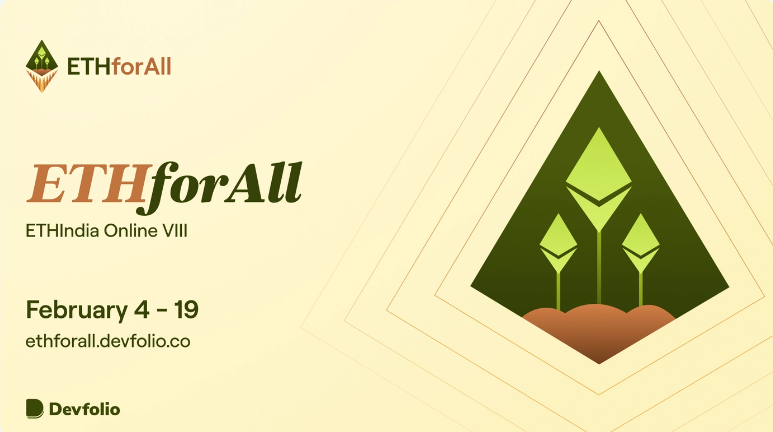
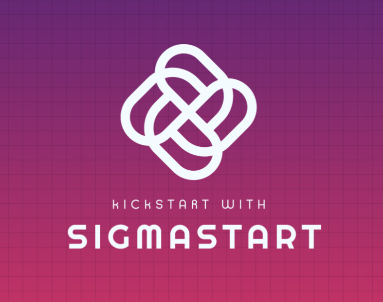

  

  

 

<b>SigmaNerds presents SigmaStart
 
Kickstart your ideas and bring them to life with SigmaStart</b>

<blockquote align="center">built on ☕ at <a href="https://ethforall.devfolio.co/">ETHforAll</a>.</blockquote>

# 💡 **Problem Statement**

In India, people do not have huge capital to spend on investment at particular moment or in one-go. Apart from this, they do not have the option of investing on recurring basis.

# 💪 Goals

- Use SigmaStart to kickstart your projects and ideas and bring them to life. 

# 🧠 Knowledge Primer

- [Arcana AuthSDK](https://www.arcana.network/) is a software development kit that provides **authentication and authorization** capabilities for web and mobile applications. It is designed to make it easy for developers to integrate secure user authentication and authorization features into their applications, without having to build these capabilities from scratch.
- [Livepeer](https://livepeer.org/) is a **decentralized video streaming platform** that uses blockchain technology to power its infrastructure. It enables developers and businesses to build and operate their own video streaming applications, while providing a secure, scalable, and cost-effective solution for video transcoding and distribution. Livepeer is open-source and community-driven, with a focus on creating a more efficient and democratic video streaming ecosystem.
- [Superfluid](https://www.superfluid.finance/) is a **decentralized finance protocol** built on the Ethereum blockchain that enables instant and continuous streaming of crypto assets. It allows for real-time, gasless transfers of tokens, which can be programmed to follow customized rules and conditions. Superfluid is designed to enable new use cases for decentralized finance, such as recurring payments, micropayments, and subscription-based models. The protocol is community-driven and open-source, and has been adopted by a range of decentralized applications and platforms.

# 💻 Tech Stack

- Next.js
- Solidity
- Arcana AuthSDK
- Livepeer 
- Superfluid  

# ⏭️ What's next

- Extending this system to more sophististicated systems. 

#   Challenges we ran into

- Since it was the first that we were working with Livepeer, uploading the video asset and playing it back from the playbackID was giving us some issues. 
- Apart from this, creating a smart contract that serves our purpose was challenging. 

# 📜 License

`SigmaStart` is available under the MIT license. See the [`LICENSE`](https://opensource.org/license/mit/) file for more info.

# 🤝 Contributing

Please read [`Contributing.md`](https://contributing.md/) for details on our code of conduct, and the process for submitting pull requests to us.

